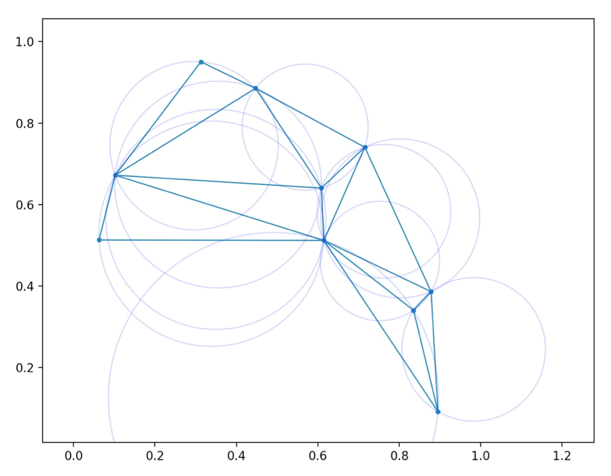
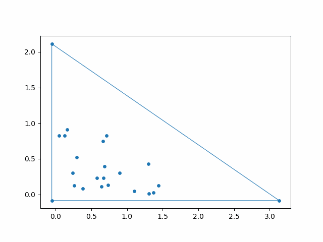

## Delaunay triangulation Watson-Bowyer

This script is implementation of the [Bowyer–Watson algorithm](https://en.wikipedia.org/wiki/Bowyer–Watson_algorithm) on Python for computing the [Delaunay triangulation](https://en.wikipedia.org/wiki/Delaunay_triangulation). 

It support either user input and random point generation. You can see or save GIF animation of step by step triangulation:

Written and tested on Python 3 with `numpy` and `matplotlib`. 